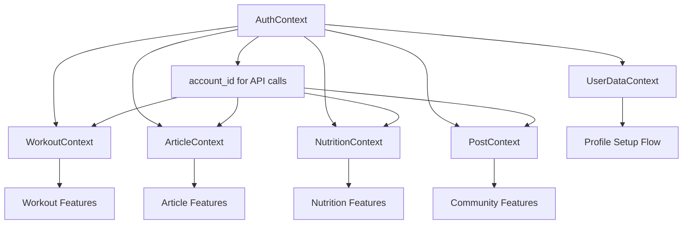

# FitBody State Management Architecture Documentation

## Table of Contents
1. [Context and Reducer Pattern Overview](#context-and-reducer-pattern-overview)
2. [State Management Architecture](#state-management-architecture)
3. [Reducer Implementation Details](#reducer-implementation-details)
4. [Context Integration Patterns](#context-integration-patterns)
5. [Code Examples and Usage Patterns](#code-examples-and-usage-patterns)

## Context and Reducer Pattern Overview

### Architecture Philosophy

The FitBody application uses React Context API with useReducer hooks for state management, providing a scalable and maintainable solution without external dependencies. This approach offers:

- **Predictable State Updates**: All state changes go through reducers with explicit action types
- **Centralized State Logic**: Business logic is contained within context providers
- **Type Safety**: Action types are defined as constants to prevent typos
- **Performance Optimization**: useCallback and useMemo prevent unnecessary re-renders
- **Simplified Authentication**: No JWT tokens, using localStorage for session persistence

### Context Provider Hierarchy

```javascript
function App() {
  return (
    <ErrorBoundary>
      <AuthProvider>                    {/* Authentication & user session */}
        <UserDataProvider>              {/* Profile setup & temporary data */}
          <WorkoutProvider>             {/* Workout data & favorites */}
            <ArticleProvider>           {/* Article content & favorites */}
              <NutritionProvider>       {/* Meal plans & nutrition data */}
                <PostProvider>          {/* Community posts & comments */}
                  {/* Application Routes */}
                </PostProvider>
              </NutritionProvider>
            </ArticleProvider>
          </WorkoutProvider>
        </UserDataProvider>
      </AuthProvider>
    </ErrorBoundary>
  );
}
```

### State Management Patterns

#### 1. **Reducer-Based State Management**
All complex state is managed through reducers with explicit action types:

```javascript
const featureReducer = (state, action) => {
  switch (action.type) {
    case 'FETCH_DATA_START':
      return { ...state, loading: true, error: null };
    case 'FETCH_DATA_SUCCESS':
      return { ...state, loading: false, data: action.payload, error: null };
    case 'FETCH_DATA_ERROR':
      return { ...state, loading: false, error: action.payload };
    default:
      return state;
  }
};
```

#### 2. **Simple State Management**
For straightforward state like user profile setup, useState is used:

```javascript
const [profileData, setProfileData] = useState(initialProfileData);
const [currentStep, setCurrentStep] = useState(0);
```

#### 3. **Hybrid Approach**
AuthContext combines both patterns - useState for simple authentication state and complex methods for API integration.

## State Management Architecture

### Context Providers Overview

| Context | Purpose | State Management | Persistence |
|---------|---------|------------------|-------------|
| **AuthContext** | User authentication & session | useState | localStorage |
| **UserDataContext** | Profile setup flow | useState | localStorage |
| **WorkoutContext** | Workout data & favorites | useReducer | API + cache |
| **ArticleContext** | Article content & favorites | useReducer | API + cache |
| **NutritionContext** | Meal plans & nutrition | useReducer | API + localStorage |
| **PostContext** | Community posts & comments | useReducer | API only |

### Provider Dependencies and Data Flow



### State Synchronization Patterns

#### 1. **Authentication-Dependent Contexts**
All feature contexts depend on AuthContext for user identification:

```javascript
export const WorkoutProvider = ({ children }) => {
  const [state, dispatch] = useReducer(workoutReducer, initialState);
  const { user } = useAuth(); // Access authenticated user
  
  const fetchFavorites = useCallback(async () => {
    if (!user?._id) return;
    // Use user._id for API calls
    const result = await workoutAPI.getFavorites(user._id);
    // Handle result...
  }, [user?._id]);
};
```

#### 2. **Cross-Context Communication**
Contexts communicate through shared user data and custom hooks:

```javascript
// Custom hook for nutrition navigation
export const useNutritionNavigation = () => {
  const { user } = useAuth();
  const { checkSetupStatus } = useNutrition();
  
  const navigateToNutrition = useCallback(async () => {
    const status = await checkSetupStatus(user._id);
    // Navigate based on setup status
  }, [user._id, checkSetupStatus]);
};
```

#### 3. **Local vs Global State Decisions**

**Global State (Context):**
- User authentication status
- Fetched data from APIs (workouts, articles, meals)
- User preferences and settings
- Application-wide loading/error states

**Local State (Component):**
- Form input values
- UI-specific state (modals, dropdowns)
- Temporary interaction state
- Component-specific loading states

### State Persistence Strategies

#### 1. **Authentication Persistence**
```javascript
// AuthContext - localStorage for session persistence
useEffect(() => {
  const checkExistingSession = () => {
    try {
      const savedUser = localStorage.getItem('user');
      if (savedUser) {
        const userData = JSON.parse(savedUser);
        setUser(userData);
        setIsAuthenticated(true);
      }
    } catch (error) {
      localStorage.removeItem('user');
    }
  };
  checkExistingSession();
}, []);
```

#### 2. **Profile Setup Persistence**
```javascript
// UserDataContext - temporary data during setup
useEffect(() => {
  localStorage.setItem('profileData', JSON.stringify(profileData));
}, [profileData]);

// Clear after successful completion
const clearProfileSetupData = () => {
  localStorage.removeItem('profileData');
  localStorage.removeItem('currentStep');
};
```

#### 3. **Feature State Persistence**
```javascript
// NutritionContext - setup completion status
const [state, dispatch] = useReducer(nutritionReducer, {
  ...initialState,
  isSetupComplete: JSON.parse(localStorage.getItem('nutritionSetupComplete') || 'false'),
});
```

#### 4. **Cache-Based Persistence**
```javascript
// WorkoutContext - in-memory caching
const initialState = {
  cache: new Map(), // For caching workout details
  lastFetch: null,  // Timestamp for cache invalidation
};

// Cache workout details to avoid repeated API calls
if (state.cache.has(workoutId)) {
  return { success: true, data: state.cache.get(workoutId) };
}
```

## Reducer Implementation Details

### Action Type Definitions and Naming Conventions

#### 1. **Consistent Naming Pattern**
All action types follow a consistent `FEATURE_ACTION_STATE` pattern:

```javascript
// NutritionContext - Comprehensive action types
const NUTRITION_ACTIONS = {
  // Loading states
  FETCH_MEALS_START: 'FETCH_MEALS_START',
  FETCH_MEALS_SUCCESS: 'FETCH_MEALS_SUCCESS',
  FETCH_MEALS_ERROR: 'FETCH_MEALS_ERROR',

  FETCH_MEAL_DETAIL_START: 'FETCH_MEAL_DETAIL_START',
  FETCH_MEAL_DETAIL_SUCCESS: 'FETCH_MEAL_DETAIL_SUCCESS',
  FETCH_MEAL_DETAIL_ERROR: 'FETCH_MEAL_DETAIL_ERROR',

  // Meal plan actions
  ADD_TO_MEAL_PLAN_START: 'ADD_TO_MEAL_PLAN_START',
  ADD_TO_MEAL_PLAN_SUCCESS: 'ADD_TO_MEAL_PLAN_SUCCESS',
  ADD_TO_MEAL_PLAN_ERROR: 'ADD_TO_MEAL_PLAN_ERROR',

  // State management
  SET_FILTERS: 'SET_FILTERS',
  SET_SEARCH_QUERY: 'SET_SEARCH_QUERY',
  SET_ACTIVE_MEAL_TYPE: 'SET_ACTIVE_MEAL_TYPE',
  CLEAR_CURRENT_MEAL: 'CLEAR_CURRENT_MEAL',
  RESET_MEALS: 'RESET_MEALS',
  CLEAR_ERROR: 'CLEAR_ERROR',
};
```

#### 2. **String-Based Action Types (Alternative Pattern)**
Some contexts use string literals for simpler actions:

```javascript
// WorkoutContext - String-based action types
const workoutReducer = (state, action) => {
  switch (action.type) {
    case 'FETCH_WORKOUTS_START':
    case 'FETCH_WORKOUTS_SUCCESS':
    case 'FETCH_WORKOUTS_ERROR':
    case 'FETCH_WORKOUT_DETAIL_START':
    case 'FETCH_WORKOUT_DETAIL_SUCCESS':
    case 'FETCH_WORKOUT_DETAIL_ERROR':
    // ... other cases
  }
};
```

### State Update Patterns and Immutability

#### 1. **Immutable State Updates**
All state updates use the spread operator to maintain immutability:

```javascript
// NutritionContext reducer - Immutable updates
const nutritionReducer = (state, action) => {
  switch (action.type) {
    case NUTRITION_ACTIONS.FETCH_MEALS_START:
      return {
        ...state,                    // Preserve existing state
        loading: true,               // Update loading state
        error: null,                 // Clear previous errors
      };

    case NUTRITION_ACTIONS.FETCH_MEALS_SUCCESS:
      return {
        ...state,
        loading: false,
        meals: action.payload.meals, // Replace meals array
        pagination: {
          ...state.pagination,       // Preserve pagination structure
          total: action.payload.total,
          hasMore: action.payload.hasMore,
        },
        lastFetch: Date.now(),       // Update cache timestamp
        error: null,
      };

    case NUTRITION_ACTIONS.SET_FILTERS:
      return {
        ...state,
        activeFilters: {
          ...state.activeFilters,    // Merge with existing filters
          ...action.payload,         // Override with new filters
        },
      };
  }
};
```

#### 2. **Array State Management**
Proper handling of array updates for lists and collections:

```javascript
// WorkoutContext - Array state management
case 'FETCH_WORKOUTS_SUCCESS':
  const newWorkouts = action.payload.data || action.payload;
  return {
    ...state,
    loading: false,
    // Conditional array handling - append or replace
    workouts: action.payload.append
      ? [...state.workouts, ...newWorkouts]  // Append for pagination
      : newWorkouts,                         // Replace for new search
    pagination: {
      ...state.pagination,
      ...action.payload.pagination,
    },
    error: null,
    lastFetch: Date.now()
  };

case 'LOG_PROGRESS_SUCCESS':
  return {
    ...state,
    // Add to multiple arrays
    progressTracking: [...state.progressTracking, action.payload],
    workoutHistory: [...state.workoutHistory, action.payload],
  };
```

#### 3. **Complex Object Updates**
Handling nested object updates while maintaining immutability:

```javascript
// PostContext - Complex object updates
case 'TOGGLE_LIKE_SUCCESS':
  return {
    ...state,
    posts: state.posts.map(post =>
      post._id === action.payload.postId
        ? {
            ...post,
            likes: action.payload.newLikeCount,
            isLiked: action.payload.isLiked,
          }
        : post
    ),
    // Update current post if it matches
    currentPost: state.currentPost?._id === action.payload.postId
      ? {
          ...state.currentPost,
          likes: action.payload.newLikeCount,
          isLiked: action.payload.isLiked,
        }
      : state.currentPost,
  };
```

### Error State Management and Loading States

#### 1. **Multi-Level Loading States**
Different loading states for different operations:

```javascript
// NutritionContext - Multiple loading states
const initialState = {
  loading: false,        // General meals loading
  detailLoading: false,  // Specific meal detail loading
  planLoading: false,    // Meal plan operations
  setupLoading: false,   // Initial setup process
  error: null,           // General error
  detailError: null,     // Detail-specific error
  planError: null,       // Plan-specific error
};

// Reducer handles each loading state independently
case NUTRITION_ACTIONS.FETCH_MEAL_DETAIL_START:
  return {
    ...state,
    detailLoading: true,   // Only affect detail loading
    detailError: null,     // Clear detail-specific errors
  };
```

#### 2. **Error Handling Patterns**
Comprehensive error state management:

```javascript
// WorkoutContext - Error handling
case 'FETCH_WORKOUTS_ERROR':
  return {
    ...state,
    loading: false,
    error: action.payload,  // Store error message
    workouts: []           // Clear data on error (optional)
  };

// Clear errors action
case 'CLEAR_ERROR':
  return {
    ...state,
    error: null,
    detailError: null,
    planError: null,
  };
```

#### 3. **Loading State Best Practices**
```javascript
// Pattern: Always set loading to true at start, false at end
case 'FETCH_DATA_START':
  return { ...state, loading: true, error: null };

case 'FETCH_DATA_SUCCESS':
  return { ...state, loading: false, data: action.payload, error: null };

case 'FETCH_DATA_ERROR':
  return { ...state, loading: false, error: action.payload };
```

### Pagination and Caching Strategies

#### 1. **Pagination State Management**
```javascript
// Standard pagination structure across contexts
const initialState = {
  pagination: {
    page: 1,
    limit: 10,
    total: 0,
    hasMore: false,
  },
};

// Pagination updates
case 'FETCH_WORKOUTS_SUCCESS':
  return {
    ...state,
    workouts: action.payload.append
      ? [...state.workouts, ...newWorkouts]
      : newWorkouts,
    pagination: {
      ...state.pagination,
      page: action.payload.append ? state.pagination.page + 1 : 1,
      total: action.payload.total || state.pagination.total,
      hasMore: action.payload.hasMore || false,
    },
  };

case 'RESET_WORKOUTS':
  return {
    ...state,
    workouts: [],
    pagination: {
      page: 1,
      limit: 10,
      total: 0,
      hasMore: false,
    },
  };
```

#### 2. **Caching Implementation**
```javascript
// WorkoutContext - Map-based caching
const initialState = {
  cache: new Map(),
  lastFetch: null,
};

// Cache workout details
case 'FETCH_WORKOUT_DETAIL_SUCCESS':
  const newCache = new Map(state.cache);
  newCache.set(action.payload.id, action.payload);

  return {
    ...state,
    detailLoading: false,
    currentWorkout: action.payload,
    cache: newCache,
    detailError: null,
  };

// Cache invalidation strategy
const isCacheValid = (lastFetch, maxAge = 5 * 60 * 1000) => {
  return lastFetch && (Date.now() - lastFetch) < maxAge;
};
```

## Context Integration Patterns

### API Service Layer Integration

#### 1. **Context-to-API Integration Pattern**
All contexts follow a consistent pattern for API integration:

```javascript
// WorkoutContext - API integration pattern
export const WorkoutProvider = ({ children }) => {
  const [state, dispatch] = useReducer(workoutReducer, initialState);
  const { user } = useAuth(); // Access authenticated user for API calls

  const fetchWorkouts = useCallback(async (filters = {}, resetPagination = true) => {
    try {
      // 1. Dispatch loading action
      dispatch({ type: 'FETCH_WORKOUTS_START' });

      // 2. Reset pagination if needed
      if (resetPagination) {
        dispatch({ type: 'RESET_WORKOUTS' });
      }

      // 3. Call API service
      const result = await workoutAPI.getWorkouts(filters);

      // 4. Handle success/error
      if (result.success) {
        dispatch({
          type: 'FETCH_WORKOUTS_SUCCESS',
          payload: {
            data: result.data,
            pagination: { total: result.data.length, hasMore: false }
          }
        });
      } else {
        dispatch({
          type: 'FETCH_WORKOUTS_ERROR',
          payload: result.error || 'Failed to fetch workouts'
        });
      }
    } catch (error) {
      dispatch({
        type: 'FETCH_WORKOUTS_ERROR',
        payload: error.message
      });
    }
  }, []);

  // 5. Provide actions and state to components
  const value = {
    ...state,
    fetchWorkouts,
    // ... other actions
  };

  return (
    <WorkoutContext.Provider value={value}>
      {children}
    </WorkoutContext.Provider>
  );
};
```

#### 2. **Authentication-Aware API Calls**
All API calls include user authentication context:

```javascript
// NutritionContext - Authentication-aware API calls
const toggleFavorite = useCallback(async (mealId) => {
  if (!user?._id) {
    return { success: false, error: 'User not authenticated' };
  }

  try {
    dispatch({ type: NUTRITION_ACTIONS.TOGGLE_FAVORITE_START });

    const result = await mealAPI.toggleFavorite({
      account_id: user._id,  // Include user ID from AuthContext
      meal_id: mealId
    });

    if (result.success) {
      dispatch({
        type: NUTRITION_ACTIONS.TOGGLE_FAVORITE_SUCCESS,
        payload: { mealId, isFavorited: result.data.isFavorited }
      });
    }

    return result;
  } catch (error) {
    dispatch({
      type: NUTRITION_ACTIONS.TOGGLE_FAVORITE_ERROR,
      payload: error.message
    });
    return { success: false, error: error.message };
  }
}, [user?._id]);
```

### Custom Hook Patterns

#### 1. **Standard Context Hook Pattern**
Every context provides a custom hook with error checking:

```javascript
// Standard pattern used across all contexts
export const useWorkout = () => {
  const context = useContext(WorkoutContext);
  if (!context) {
    throw new Error('useWorkout must be used within a WorkoutProvider');
  }
  return context;
};

export const useAuth = () => {
  const context = useContext(AuthContext);
  if (!context) {
    throw new Error('useAuth must be used within an AuthProvider');
  }
  return context;
};

export const useNutrition = () => {
  const context = useContext(NutritionContext);
  if (!context) {
    throw new Error('useNutrition must be used within a NutritionProvider');
  }
  return context;
};
```

#### 2. **Cross-Context Custom Hooks**
Custom hooks that combine multiple contexts for specific functionality:

```javascript
// useNutritionNavigation - Combines AuthContext and NutritionContext
export const useNutritionNavigation = () => {
  const navigate = useNavigate();
  const { user } = useAuth();
  const { checkSetupStatus } = useNutrition();

  const navigateToNutrition = useCallback(async () => {
    if (!user?._id) {
      console.warn('User not authenticated');
      return;
    }

    try {
      // Check user's meal plan status using NutritionContext
      const status = await checkSetupStatus(user._id);

      if (status.hasPlans) {
        navigate('/nutrition/main');
      } else {
        navigate('/nutrition/setup');
      }
    } catch (error) {
      console.error('Error checking meal plan status:', error);
      navigate('/nutrition/setup'); // Fallback
    }
  }, [user?._id, checkSetupStatus, navigate]);

  return { navigateToNutrition };
};
```

### Component Consumption Patterns

#### 1. **Basic Context Consumption**
Standard pattern for consuming context in components:

```javascript
// CommunityFeedScreen - Basic context consumption
import { usePost } from '../../contexts/PostContext';
import { useAuth } from '../../contexts/AuthContext';

const CommunityFeedScreen = () => {
  const {
    posts,
    loading,
    error,
    fetchPosts,
    toggleLike,
    incrementView
  } = usePost();

  const { user, isAuthenticated } = useAuth();

  useEffect(() => {
    fetchPosts();
  }, [fetchPosts]);

  const handleToggleLike = async (postId, currentLikeStatus) => {
    if (!isAuthenticated) {
      // Handle unauthenticated state
      return;
    }
    await toggleLike(postId);
  };

  if (loading) return <LoadingSpinner />;
  if (error) return <ErrorMessage message={error} />;

  return (
    <VStack>
      {posts.map(post => (
        <PostCard
          key={post._id}
          post={post}
          onLike={() => handleToggleLike(post._id)}
        />
      ))}
    </VStack>
  );
};
```

#### 2. **Advanced Context Integration**
Components that use multiple contexts and handle complex state interactions:

```javascript
// Home - Multiple context integration
import { useAuth } from '../../contexts/AuthContext';
import { useArticle } from '../../contexts/ArticleContext';
import { useWorkout } from '../../contexts/WorkoutContext';
import { useNutritionNavigation } from '../../hooks/useNutritionNavigation';

const Home = () => {
  const { user } = useAuth();
  const {
    articles,
    loading: articlesLoading,
    fetchFeaturedArticles
  } = useArticle();
  const {
    workouts,
    loading: workoutsLoading,
    fetchPopularWorkouts
  } = useWorkout();
  const { navigateToNutrition } = useNutritionNavigation();

  useEffect(() => {
    // Fetch data from multiple contexts
    fetchFeaturedArticles();
    fetchPopularWorkouts();
  }, [fetchFeaturedArticles, fetchPopularWorkouts]);

  const handleNutritionClick = async () => {
    // Use cross-context hook for navigation
    await navigateToNutrition();
  };

  return (
    <AppContainer hasBottomNav>
      <VStack spacing={6} p={6}>
        {/* User greeting */}
        <Text>Welcome back, {user?.firstName}!</Text>

        {/* Featured content from multiple contexts */}
        <FeaturedArticles articles={articles} loading={articlesLoading} />
        <PopularWorkouts workouts={workouts} loading={workoutsLoading} />

        {/* Navigation using cross-context logic */}
        <Button onClick={handleNutritionClick}>
          View Nutrition Plan
        </Button>
      </VStack>
      <BottomNavigation />
    </AppContainer>
  );
};
```

### State Persistence Strategies

#### 1. **Authentication State Persistence**
```javascript
// AuthContext - Session persistence with localStorage
export const AuthProvider = ({ children }) => {
  const [user, setUser] = useState(null);
  const [isAuthenticated, setIsAuthenticated] = useState(false);
  const [isLoading, setIsLoading] = useState(true);

  // Check for existing session on mount
  useEffect(() => {
    const checkExistingSession = () => {
      try {
        const savedUser = localStorage.getItem('user');
        if (savedUser) {
          const userData = JSON.parse(savedUser);
          setUser(userData);
          setIsAuthenticated(true);
        }
      } catch (error) {
        console.error('Error parsing saved user data:', error);
        localStorage.removeItem('user'); // Clean up corrupted data
      } finally {
        setIsLoading(false);
      }
    };

    checkExistingSession();
  }, []);

  const login = async (username, password) => {
    setIsLoading(true);
    try {
      const result = await api.auth.login(username, password);
      if (result.success) {
        const userData = result.data;
        setUser(userData);
        setIsAuthenticated(true);
        // Persist session
        localStorage.setItem('user', JSON.stringify(userData));
        return { success: true };
      }
    } finally {
      setIsLoading(false);
    }
  };

  const logout = () => {
    setUser(null);
    setIsAuthenticated(false);
    localStorage.removeItem('user'); // Clear persisted session
  };
};
```

#### 2. **Temporary Data Persistence**
```javascript
// UserDataContext - Profile setup data persistence
export const UserDataProvider = ({ children }) => {
  const [profileData, setProfileData] = useState(initialProfileData);
  const [currentStep, setCurrentStep] = useState(0);

  // Load saved data on mount
  useEffect(() => {
    const savedData = localStorage.getItem('profileData');
    if (savedData) {
      try {
        setProfileData(JSON.parse(savedData));
      } catch (error) {
        console.error('Error parsing profile data:', error);
        localStorage.removeItem('profileData');
      }
    }

    const savedStep = localStorage.getItem('currentStep');
    if (savedStep) {
      setCurrentStep(parseInt(savedStep, 10));
    }
  }, []);

  // Auto-save data changes
  useEffect(() => {
    localStorage.setItem('profileData', JSON.stringify(profileData));
  }, [profileData]);

  useEffect(() => {
    localStorage.setItem('currentStep', currentStep.toString());
  }, [currentStep]);

  // Clear temporary data after successful completion
  const clearProfileSetupData = () => {
    localStorage.removeItem('profileData');
    localStorage.removeItem('currentStep');
    setCurrentStep(0);
    setProfileData(initialProfileData);
  };
};
```

## Code Examples and Usage Patterns

### Real-World State Update Scenarios

#### 1. **Workout Favorites Management**

**Before State:**
```javascript
{
  workouts: [
    { _id: '1', title: 'Morning Cardio', isFavorited: false },
    { _id: '2', title: 'Strength Training', isFavorited: true }
  ],
  favorites: ['2'],
  favoritesLoading: false
}
```

**Action Dispatch:**
```javascript
// User clicks favorite button on workout '1'
const toggleFavorite = async (workoutId) => {
  dispatch({ type: 'TOGGLE_FAVORITE_START' });

  const result = await workoutAPI.toggleFavorite({
    account_id: user._id,
    lesson_id: workoutId
  });

  if (result.success) {
    dispatch({
      type: 'TOGGLE_FAVORITE_SUCCESS',
      payload: { workoutId, isFavorited: result.data.isFavorited }
    });
  }
};
```

**After State:**
```javascript
{
  workouts: [
    { _id: '1', title: 'Morning Cardio', isFavorited: true },  // Updated
    { _id: '2', title: 'Strength Training', isFavorited: true }
  ],
  favorites: ['2', '1'],  // Added workout '1'
  favoritesLoading: false
}
```

#### 2. **Article Search and Filtering**

**Before State:**
```javascript
{
  articles: [...], // Previous articles
  searchQuery: '',
  activeCategory: 'all',
  loading: false
}
```

**Action Sequence:**
```javascript
// User types in search box
dispatch({ type: 'SET_SEARCH_QUERY', payload: 'nutrition' });

// User selects category
dispatch({ type: 'SET_ACTIVE_CATEGORY', payload: 'fitness' });

// Fetch filtered articles
dispatch({ type: 'FETCH_ARTICLES_START' });
const result = await articleAPI.getArticles({
  search: 'nutrition',
  category: 'fitness'
});
dispatch({ type: 'FETCH_ARTICLES_SUCCESS', payload: result.data });
```

**After State:**
```javascript
{
  articles: [...], // New filtered articles
  searchQuery: 'nutrition',
  activeCategory: 'fitness',
  loading: false
}
```

#### 3. **Nutrition Setup Flow**

**Initial State:**
```javascript
{
  isSetupComplete: false,
  setupLoading: false,
  mealPlans: [],
  activeFilters: { dietary: 'no-preferences' }
}
```

**Setup Process:**
```javascript
// User completes meal plan setup
const setupMealPlan = async (preferences) => {
  dispatch({ type: NUTRITION_ACTIONS.SET_SETUP_LOADING, payload: true });

  const result = await mealAPI.createMealPlan({
    account_id: user._id,
    dietary_preferences: preferences.dietary
  });

  if (result.success) {
    dispatch({ type: NUTRITION_ACTIONS.SET_SETUP_COMPLETE, payload: true });
    localStorage.setItem('nutritionSetupComplete', 'true');
  }

  dispatch({ type: NUTRITION_ACTIONS.SET_SETUP_LOADING, payload: false });
};
```

**Final State:**
```javascript
{
  isSetupComplete: true,
  setupLoading: false,
  mealPlans: [...], // Created meal plans
  activeFilters: { dietary: 'vegetarian' } // Updated preferences
}
```

### Error Handling and Loading State Examples

#### 1. **Network Error Handling**
```javascript
// Component handling network errors
const WorkoutScreen = () => {
  const { workouts, loading, error, fetchWorkouts, clearError } = useWorkout();
  const toast = useToast();

  useEffect(() => {
    fetchWorkouts();
  }, [fetchWorkouts]);

  useEffect(() => {
    if (error) {
      toast({
        title: 'Error Loading Workouts',
        description: error,
        status: 'error',
        duration: 5000,
        isClosable: true,
      });
      clearError(); // Clear error after showing toast
    }
  }, [error, toast, clearError]);

  if (loading) {
    return <LoadingSpinner message="Loading workouts..." />;
  }

  return (
    <VStack>
      {workouts.map(workout => (
        <WorkoutCard key={workout._id} workout={workout} />
      ))}
    </VStack>
  );
};
```

#### 2. **Optimistic Updates with Error Rollback**
```javascript
// PostContext - Optimistic like toggle
const toggleLike = useCallback(async (postId) => {
  const post = state.posts.find(p => p._id === postId);
  if (!post) return;

  // Optimistic update
  dispatch({
    type: 'TOGGLE_LIKE_OPTIMISTIC',
    payload: {
      postId,
      newLikeCount: post.isLiked ? post.likes - 1 : post.likes + 1,
      isLiked: !post.isLiked
    }
  });

  try {
    const result = await postAPI.toggleLike(postId, user._id);

    if (!result.success) {
      // Rollback on failure
      dispatch({
        type: 'TOGGLE_LIKE_ROLLBACK',
        payload: { postId, originalLikes: post.likes, originalIsLiked: post.isLiked }
      });
    }
  } catch (error) {
    // Rollback on error
    dispatch({
      type: 'TOGGLE_LIKE_ROLLBACK',
      payload: { postId, originalLikes: post.likes, originalIsLiked: post.isLiked }
    });
  }
}, [state.posts, user._id]);
```

### Performance Optimization Techniques

#### 1. **useCallback for Action Functions**
```javascript
// Prevent unnecessary re-renders with useCallback
export const WorkoutProvider = ({ children }) => {
  const [state, dispatch] = useReducer(workoutReducer, initialState);

  const fetchWorkouts = useCallback(async (filters = {}) => {
    // Implementation...
  }, []); // No dependencies - function never changes

  const fetchWorkoutById = useCallback(async (workoutId) => {
    // Check cache first
    if (state.cache.has(workoutId)) {
      return { success: true, data: state.cache.get(workoutId) };
    }
    // Fetch from API...
  }, [state.cache]); // Only re-create when cache changes

  const setActiveFilter = useCallback((filter) => {
    dispatch({ type: 'SET_ACTIVE_FILTER', payload: filter });
  }, []); // Simple dispatch - no dependencies needed
};
```

#### 2. **Memoized Computed Values**
```javascript
// NutritionContext - Memoized filtering
const getFilteredMealsByType = useMemo(() => {
  return (mealType) => {
    return state.meals.filter(meal => {
      const matchesType = mealType === 'all' || meal.type === mealType;
      const matchesDietary = state.activeFilters.dietary === 'no-preferences' ||
                            meal.dietary === state.activeFilters.dietary;
      const matchesSearch = !state.searchQuery ||
                           meal.title.toLowerCase().includes(state.searchQuery.toLowerCase());

      return matchesType && matchesDietary && matchesSearch;
    });
  };
}, [state.meals, state.activeFilters, state.searchQuery]);
```

#### 3. **Cache-Based Performance**
```javascript
// ArticleContext - Intelligent caching
const fetchArticleById = useCallback(async (articleId) => {
  // Check cache first
  if (state.cache.has(articleId)) {
    const cachedArticle = state.cache.get(articleId);
    dispatch({
      type: 'FETCH_ARTICLE_DETAIL_SUCCESS',
      payload: cachedArticle
    });
    return { success: true, data: cachedArticle };
  }

  // Cache miss - fetch from API
  dispatch({ type: 'FETCH_ARTICLE_DETAIL_START' });

  try {
    const result = await articleAPI.getArticleById(articleId);

    if (result.success) {
      // Update cache
      const newCache = new Map(state.cache);
      newCache.set(articleId, result.data);

      dispatch({
        type: 'FETCH_ARTICLE_DETAIL_SUCCESS',
        payload: result.data,
        meta: { cache: newCache }
      });
    }

    return result;
  } catch (error) {
    dispatch({
      type: 'FETCH_ARTICLE_DETAIL_ERROR',
      payload: error.message
    });
  }
}, [state.cache]);
```

---

This comprehensive state management documentation covers all aspects of the FitBody application's state architecture, from basic patterns to advanced optimization techniques. The system provides a robust, scalable foundation for managing complex application state while maintaining performance and developer experience.
