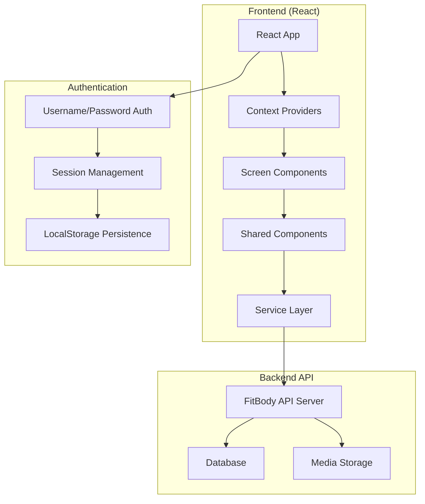
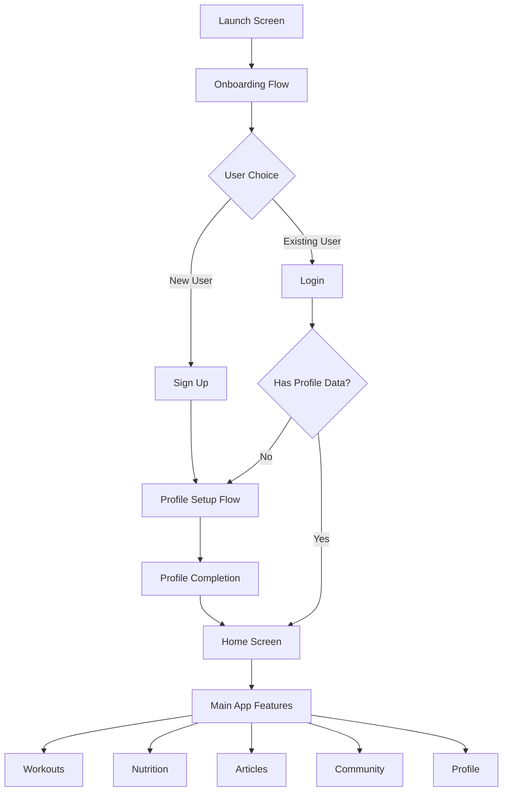

# FitBody Fitness Web Application - Technical Documentation

## Table of Contents
1. [Application Architecture Overview](#application-architecture-overview)
2. [Technology Stack](#technology-stack)
3. [Project Structure](#project-structure)
4. [User Flow Documentation](#user-flow-documentation)
5. [Backend-to-Frontend Integration](#backend-to-frontend-integration)
6. [API Integration Patterns](#api-integration-patterns)
7. [Component Architecture](#component-architecture)
8. [Development Workflow](#development-workflow)

## Application Architecture Overview

### High-Level System Architecture



### Core Design Principles

- **Mobile-First Responsive Design**: Optimized for maximum width of 450px
- **Dark Theme Consistency**: Background color #232323 with white text
- **Simplified Authentication**: Username/password without JWT tokens
- **Context-Based State Management**: Separate contexts for different features
- **Real API Integration**: Connected to fitbody-api backend on localhost:1200

## Technology Stack

### Frontend Technologies
- **React 18**: Core framework with hooks and functional components
- **Chakra UI**: Component library for consistent styling
- **React Router v6**: Client-side routing and navigation
- **Framer Motion**: Animations and transitions
- **Context API**: State management across components

### Backend Integration
- **FitBody API**: RESTful API running on port 1200
- **HTTP/JSON**: Standard REST API communication
- **LocalStorage**: Session persistence and temporary data storage

### Development Tools
- **Create React App**: Project bootstrapping and build tools
- **ESLint**: Code linting and formatting
- **npm**: Package management

## Project Structure

```
src/
├── components/           # Reusable UI components
│   ├── Auth/            # Authentication components
│   ├── Error/           # Error handling components
│   ├── Layout/          # Layout and container components
│   ├── Loading/         # Loading state components
│   ├── Navigation/      # Navigation components
│   ├── ProfileSetup/    # Profile setup form components
│   └── Video/           # Video player components
├── contexts/            # React Context providers
│   ├── AuthContext.js   # Authentication state
│   ├── UserDataContext.js # User profile data
│   ├── WorkoutContext.js # Workout data and state
│   ├── ArticleContext.js # Article content state
│   ├── NutritionContext.js # Nutrition and meal data
│   └── PostContext.js   # Community posts state
├── screens/             # Feature-based screen components
│   ├── Auth/            # Authentication screens
│   ├── Core/            # Core app screens (Launch, Home)
│   ├── Onboarding/      # User onboarding flow
│   ├── Profile/         # User profile management
│   ├── Workout/         # Workout features
│   ├── Article/         # Article content
│   ├── Nutrition/       # Nutrition and meal planning
│   └── Community/       # Community features
├── services/            # API service layer
│   ├── api.js           # Core API configuration
│   ├── workoutAPI.js    # Workout-related API calls
│   ├── articleAPI.js    # Article API integration
│   ├── mealAPI.js       # Nutrition API calls
│   └── postAPI.js       # Community API calls
├── hooks/               # Custom React hooks
├── theme.js             # Chakra UI theme configuration
├── App.js               # Main application component
└── index.js             # Application entry point
```

## User Flow Documentation

### Complete User Journey



### Authentication Flow Details

1. **Launch Screen** (`/`)
   - Auto-redirects to onboarding after 3 seconds
   - Animated brand introduction

2. **Onboarding Flow** (`/onboarding`)
   - Multi-step introduction to app features
   - Skip option available
   - Leads to login/signup choice

3. **Sign Up Process** (`/signup`)
   - Username validation (4-30 characters)
   - Password validation (6-30 characters)
   - Real-time form validation
   - Automatic redirect to profile setup

4. **Profile Setup Flow** (`/profile-setup`)
   - 8-step guided setup process:
     - Welcome screen
     - Gender selection
     - Age input
     - Weight input (kg/lbs)
     - Height input (cm/ft-in)
     - Fitness goal selection
     - Activity level selection
     - Completion confirmation
   - Progress tracking with visual indicators
   - Data persistence in localStorage during setup
   - Integration with backend API on completion

5. **Login Process** (`/login`)
   - Username/password authentication
   - Session persistence via localStorage
   - Conditional redirect based on profile completion status

### Navigation Patterns

#### Protected Routes
All main application features require authentication:
- Home (`/home`)
- Workouts (`/workout`, `/workout/:id`)
- Articles (`/articles`, `/articles/:id`)
- Nutrition (`/nutrition/*`)
- Community (`/community`, `/community/post/:id`)
- Profile (`/profile`, `/profile/edit`, `/profile/favorites`)

#### Bottom Navigation
Persistent navigation bar with 4 main sections:
- **Home**: Dashboard and feature overview
- **Community**: Social features and user posts
- **Progress**: User statistics and achievements
- **Profile**: User settings and personal data

#### Conditional Navigation
- **New Users**: Automatically routed through setup flow
- **Existing Users**: Direct access to main features
- **Nutrition Setup**: Conditional routing based on meal plan status

## Backend-to-Frontend Integration Details

### API Configuration

The application connects to the FitBody API backend with the following configuration:

```javascript
// Base API URL configuration
const API_BASE_URL = process.env.REACT_APP_API_URL || 'http://localhost:1200';

// Standard API call wrapper
const apiCall = async (endpoint, options = {}) => {
  const response = await fetch(`${API_BASE_URL}${endpoint}`, {
    headers: {
      'Content-Type': 'application/json',
      ...options.headers,
    },
    ...options,
  });

  const data = await response.json();
  return { success: response.ok, data, statusCode: response.status };
};
```

### Authentication System

#### Session Management
- **No JWT Tokens**: Simplified authentication using username/password verification
- **LocalStorage Persistence**: User data stored locally for session continuity
- **Account ID Integration**: Backend uses `account_id` for user identification

```javascript
// Authentication flow
const login = async (username, password) => {
  const result = await authAPI.login(username, password);
  if (result.success) {
    setUser(result.data);
    setIsAuthenticated(true);
    localStorage.setItem('user', JSON.stringify(result.data));
  }
  return result;
};
```

#### User Data Structure
```javascript
// User object structure from backend
{
  _id: "user_id",
  username: "user123",
  email: "user@example.com",
  firstName: "John",
  lastName: "Doe",
  gender: "male",
  age: 25,
  weight: 70,
  height: 175,
  goal: "weight_loss",
  activityLevel: "moderate"
}
```

### Data Flow Architecture

#### Workout System Integration

**API Endpoints:**
- `GET /api/lessons` - Fetch workouts with filtering
- `GET /api/lessons/:id` - Get specific workout details
- `GET /api/guides/lessons/:lesson_id` - Get exercise guides for workout
- `POST/DELETE /api/favorites/lessons` - Manage workout favorites

**Data Transformation:**
```javascript
// Backend lesson data transformation
const transformWorkoutData = (workout) => ({
  ...workout,
  avatar: getMediaUrl(workout.avatar), // Convert relative to absolute URLs
  duration: workout.duration || 30,
  difficulty: workout.level || 'beginner',
  exercises: workout.guides || []
});
```

**State Management Flow:**
```javascript
// WorkoutContext integration
const fetchWorkouts = async (filters = {}) => {
  dispatch({ type: 'FETCH_WORKOUTS_START' });
  const result = await workoutAPI.getWorkouts(filters);

  if (result.success) {
    dispatch({
      type: 'FETCH_WORKOUTS_SUCCESS',
      payload: result.data
    });
  } else {
    dispatch({
      type: 'FETCH_WORKOUTS_ERROR',
      payload: result.error
    });
  }
};
```

#### Article System Integration

**API Endpoints:**
- `GET /api/articles` - Fetch articles with search/filtering
- `GET /api/articles/:id` - Get specific article content
- `POST/DELETE /api/favorites/articles` - Manage article favorites

**Content Management:**
```javascript
// Article data structure
{
  _id: "article_id",
  title: "Article Title",
  content: "Article content...",
  author: "Author Name",
  category: "fitness",
  featured_image: "/uploads/article_image.jpg",
  created_at: "2024-01-01T00:00:00Z",
  is_favorited: false
}
```

#### Nutrition System Integration

**API Endpoints:**
- `GET /api/meals` - Fetch meals with dietary filtering
- `GET /api/meals/:id` - Get specific meal details
- `POST /api/meal-plans` - Create personalized meal plans

**Meal Plan Flow:**
```javascript
// Nutrition setup and meal plan creation
const setupMealPlan = async (preferences) => {
  dispatch({ type: 'SETUP_MEAL_PLAN_START' });

  // Create meal plan based on user preferences
  const result = await mealAPI.createMealPlan({
    account_id: user._id,
    dietary_preferences: preferences.dietary,
    meal_types: ['breakfast', 'lunch', 'dinner', 'snack']
  });

  if (result.success) {
    dispatch({ type: 'SETUP_MEAL_PLAN_SUCCESS' });
    setSetupComplete(true);
  }
};
```

### Media File Handling

#### Static File URLs
```javascript
// Media URL construction
const getMediaUrl = (filename) => {
  if (!filename) return null;
  if (filename.startsWith('http')) return filename;
  return `${API_BASE_URL}/${filename}`;
};

// Usage in components
<Image src={getMediaUrl(workout.avatar)} alt={workout.title} />
<video src={getMediaUrl(exercise.video_url)} controls />
```

#### File Upload Patterns
```javascript
// Profile picture upload (planned)
const uploadProfilePicture = async (file) => {
  const formData = new FormData();
  formData.append('avatar', file);
  formData.append('account_id', user._id);

  return apiCall('/api/accounts/avatar', {
    method: 'POST',
    body: formData,
    headers: {} // Remove Content-Type for FormData
  });
};
```

### Error Handling Patterns

#### API Error Handling
```javascript
// Standardized error handling across all API calls
const handleApiError = (error, context) => {
  console.error(`❌ ${context} error:`, error);

  // User-friendly error messages
  const errorMessages = {
    400: 'Invalid request. Please check your input.',
    401: 'Authentication required. Please log in.',
    403: 'Access denied. You don\'t have permission.',
    404: 'Resource not found.',
    500: 'Server error. Please try again later.'
  };

  return errorMessages[error.statusCode] || error.message || 'An unexpected error occurred';
};
```

#### Context Error States
```javascript
// Error state management in contexts
const workoutReducer = (state, action) => {
  switch (action.type) {
    case 'FETCH_WORKOUTS_ERROR':
      return {
        ...state,
        loading: false,
        error: action.payload,
        workouts: [] // Clear data on error
      };
    case 'CLEAR_ERROR':
      return {
        ...state,
        error: null,
        detailError: null
      };
  }
};
```

## API Integration Patterns

### Service Layer Architecture

The application uses a layered service architecture to separate API concerns:

```
Frontend Components
       ↓
Context Providers (State Management)
       ↓
Service Layer (API Abstraction)
       ↓
Backend API
```

#### Core Service Structure

**Base API Service** (`src/services/api.js`)
- Authentication endpoints
- Core user profile management
- Shared API configuration

**Feature-Specific Services:**
- `workoutAPI.js` - Workout and exercise data
- `articleAPI.js` - Article content management
- `mealAPI.js` - Nutrition and meal planning
- `postAPI.js` - Community features

#### Request/Response Patterns

**Standard Request Format:**
```javascript
// GET request with query parameters
const getWorkouts = async (filters = {}) => {
  const queryParams = new URLSearchParams();
  if (filters.level) queryParams.append('level', filters.level);
  if (filters.category) queryParams.append('category', filters.category);

  const endpoint = `/api/lessons${queryParams.toString() ? `?${queryParams}` : ''}`;
  return apiCall(endpoint);
};

// POST request with JSON body
const createMealPlan = async (planData) => {
  return apiCall('/api/meal-plans', {
    method: 'POST',
    body: JSON.stringify({
      account_id: planData.userId,
      dietary_preferences: planData.dietary,
      meal_types: planData.mealTypes
    })
  });
};
```

**Standard Response Format:**
```javascript
// Successful response
{
  success: true,
  data: [...], // Actual data
  statusCode: 200
}

// Error response
{
  success: false,
  error: "Error message",
  statusCode: 400
}
```

#### Authentication Integration

**Account ID Pattern:**
```javascript
// All authenticated requests include account_id
const addToFavorites = async (itemId, itemType) => {
  return apiCall(`/api/favorites/${itemType}`, {
    method: 'POST',
    body: JSON.stringify({
      account_id: user._id, // From AuthContext
      item_id: itemId
    })
  });
};
```

**Session Persistence:**
```javascript
// Check authentication on app load
useEffect(() => {
  const checkExistingSession = () => {
    try {
      const savedUser = localStorage.getItem('user');
      if (savedUser) {
        const userData = JSON.parse(savedUser);
        setUser(userData);
        setIsAuthenticated(true);
      }
    } catch (error) {
      localStorage.removeItem('user');
    }
  };

  checkExistingSession();
}, []);
```

### State Management Integration

#### Context Provider Pattern
```javascript
// Feature-specific context with API integration
export const WorkoutProvider = ({ children }) => {
  const [state, dispatch] = useReducer(workoutReducer, initialState);
  const { user } = useAuth(); // Access to authenticated user

  const fetchWorkouts = useCallback(async (filters = {}) => {
    dispatch({ type: 'FETCH_WORKOUTS_START' });

    try {
      const result = await workoutAPI.getWorkouts(filters);

      if (result.success) {
        dispatch({
          type: 'FETCH_WORKOUTS_SUCCESS',
          payload: result.data
        });
      } else {
        dispatch({
          type: 'FETCH_WORKOUTS_ERROR',
          payload: result.error
        });
      }
    } catch (error) {
      dispatch({
        type: 'FETCH_WORKOUTS_ERROR',
        payload: error.message
      });
    }
  }, []);

  const value = {
    ...state,
    fetchWorkouts,
    // ... other actions
  };

  return (
    <WorkoutContext.Provider value={value}>
      {children}
    </WorkoutContext.Provider>
  );
};
```

#### Hook Integration Pattern
```javascript
// Custom hook for component integration
export const useWorkout = () => {
  const context = useContext(WorkoutContext);
  if (!context) {
    throw new Error('useWorkout must be used within WorkoutProvider');
  }
  return context;
};

// Usage in components
const WorkoutScreen = () => {
  const { workouts, loading, error, fetchWorkouts } = useWorkout();

  useEffect(() => {
    fetchWorkouts({ level: 'beginner' });
  }, [fetchWorkouts]);

  if (loading) return <LoadingSpinner />;
  if (error) return <ErrorMessage message={error} />;

  return (
    <VStack>
      {workouts.map(workout => (
        <WorkoutCard key={workout._id} workout={workout} />
      ))}
    </VStack>
  );
};
```

## Component Architecture

### Screen Organization by Feature

The application follows a feature-based folder structure for better maintainability:

```
src/screens/
├── Auth/                 # Authentication screens
│   ├── LoginScreen.js
│   ├── SignUpScreen.js
│   ├── ForgotPasswordScreen.js
│   └── SetPasswordScreen.js
├── Core/                 # Core application screens
│   ├── LaunchScreen.js
│   └── Home.js
├── Onboarding/           # User onboarding flow
│   ├── OnboardingFlow.js
│   └── ProfileSetupFlow.js
├── Profile/              # User profile management
│   ├── ProfileScreen.js
│   ├── EditProfileScreen.js
│   ├── FavoritesScreen.js
│   ├── ProgressScreen.js
│   └── SettingsScreen.js
├── Workout/              # Workout features
│   ├── WorkoutsScreen.js
│   ├── WorkoutDetailScreen.js
│   ├── ExerciseDetailScreen.js
│   └── CreateRoutineScreen.js
├── Article/              # Article content
│   ├── ArticleListScreen.js
│   └── ArticleDetailScreen.js
├── Nutrition/            # Nutrition features
│   ├── NutritionRedirect.js
│   ├── MealPlanSetupScreen.js
│   ├── MealPlanMainScreen.js
│   ├── MealPlanLoadingScreen.js
│   ├── MealPlanDetailScreen.js
│   └── MealDetailScreen.js
└── Community/            # Community features
    ├── CommunityFeedScreen.js
    ├── CreatePostScreen.js
    └── PostDetailScreen.js
```

### Shared Components and Utilities

#### Layout Components

**AppContainer** - Main application wrapper
```javascript
const AppContainer = ({ children, hasBottomNav = false }) => (
  <Box
    minH="100vh"
    bg="#232323"
    display="flex"
    alignItems="center"
    justifyContent="center"
    p={4}
  >
    <Box
      border="1px solid white"
      borderRadius="xl"
      maxW="450px"
      minH="950px"
      w="full"
      bg="#232323"
      overflow="hidden"
      position="relative"
    >
      <Box
        flex="1"
        overflow="auto"
        height={hasBottomNav ? "calc(100% - 80px)" : "950px"}
        sx={{
          scrollbarWidth: 'none',
          '&::-webkit-scrollbar': { display: 'none' }
        }}
      >
        {children}
      </Box>
    </Box>
  </Box>
);
```

**BottomNavigation** - Persistent navigation
```javascript
const navigationItems = [
  { id: 'home', label: 'Home', icon: HamburgerIcon, path: '/home' },
  { id: 'community', label: 'Community', icon: ChatIcon, path: '/community' },
  { id: 'progress', label: 'Progress', icon: StarIcon, path: '/progress' },
  { id: 'profile', label: 'Profile', icon: InfoIcon, path: '/profile' }
];
```

#### Form Components

**Profile Setup Components** - Multi-step form system
```javascript
// Reusable form step pattern
const GenderSelection = ({ onNext, onPrev }) => {
  const { profileData, updateProfileData } = useUserData();

  const handleGenderSelect = (gender) => {
    updateProfileData({ gender });
    onNext();
  };

  return (
    <VStack spacing={6}>
      {genderOptions.map(option => (
        <Button
          key={option.value}
          variant={profileData.gender === option.value ? 'solid' : 'outline'}
          onClick={() => handleGenderSelect(option.value)}
        >
          {option.label}
        </Button>
      ))}
    </VStack>
  );
};
```

#### Loading and Error Components

**LoadingSpinner** - Consistent loading states
```javascript
const LoadingSpinner = ({
  message = 'Loading...',
  size = 'xl',
  fullScreen = false
}) => {
  const content = (
    <VStack spacing={4}>
      <Spinner size={size} color="primary.500" />
      <Text color="white">{message}</Text>
    </VStack>
  );

  return fullScreen ? (
    <Box position="fixed" top="0" left="0" right="0" bottom="0"
         bg="#232323" display="flex" alignItems="center"
         justifyContent="center" zIndex={9999}>
      {content}
    </Box>
  ) : content;
};
```

**ErrorBoundary** - Application-wide error handling
```javascript
class ErrorBoundary extends Component {
  constructor(props) {
    super(props);
    this.state = { hasError: false, error: null };
  }

  static getDerivedStateFromError(error) {
    return { hasError: true, error };
  }

  componentDidCatch(error, errorInfo) {
    console.error('ErrorBoundary caught an error:', error, errorInfo);
  }

  render() {
    if (this.state.hasError) {
      return <ErrorFallback error={this.state.error} />;
    }
    return this.props.children;
  }
}
```

### Context Providers and State Management

#### Provider Hierarchy
```javascript
function App() {
  return (
    <ErrorBoundary>
      <AuthProvider>
        <UserDataProvider>
          <WorkoutProvider>
            <ArticleProvider>
              <NutritionProvider>
                <PostProvider>
                  {/* App content */}
                </PostProvider>
              </NutritionProvider>
            </ArticleProvider>
          </WorkoutProvider>
        </UserDataProvider>
      </AuthProvider>
    </ErrorBoundary>
  );
}
```

#### Context Design Pattern
```javascript
// Standard context structure
const FeatureContext = createContext();

export const useFeature = () => {
  const context = useContext(FeatureContext);
  if (!context) {
    throw new Error('useFeature must be used within FeatureProvider');
  }
  return context;
};

export const FeatureProvider = ({ children }) => {
  const [state, dispatch] = useReducer(featureReducer, initialState);

  // API integration methods
  const fetchData = useCallback(async () => {
    // Implementation
  }, []);

  const value = {
    ...state,
    fetchData,
    // Other actions
  };

  return (
    <FeatureContext.Provider value={value}>
      {children}
    </FeatureContext.Provider>
  );
};
```

### Routing Structure and Navigation Patterns

#### Route Configuration
```javascript
// Main application routes
<Routes>
  {/* Public routes */}
  <Route path="/" element={<LaunchScreen />} />
  <Route path="/onboarding" element={<OnboardingFlow />} />
  <Route path="/login" element={<LoginScreen />} />
  <Route path="/signup" element={<SignUpScreen />} />
  <Route path="/profile-setup" element={<ProfileSetupFlow />} />

  {/* Protected routes */}
  <Route path="/home" element={<ProtectedRoute><Home /></ProtectedRoute>} />

  {/* Workout routes */}
  <Route path="/workout" element={<ProtectedRoute><WorkoutsScreen /></ProtectedRoute>} />
  <Route path="/workout/:id" element={<ProtectedRoute><WorkoutDetailScreen /></ProtectedRoute>} />
  <Route path="/workout/:workoutId/exercise/:exerciseId"
         element={<ProtectedRoute><ExerciseDetailScreen /></ProtectedRoute>} />

  {/* Article routes */}
  <Route path="/articles" element={<ProtectedRoute><ArticleListScreen /></ProtectedRoute>} />
  <Route path="/articles/:id" element={<ProtectedRoute><ArticleDetailScreen /></ProtectedRoute>} />

  {/* Nutrition routes */}
  <Route path="/nutrition" element={<ProtectedRoute><NutritionRedirect /></ProtectedRoute>} />
  <Route path="/nutrition/setup" element={<ProtectedRoute><MealPlanSetupScreen /></ProtectedRoute>} />
  <Route path="/nutrition/main" element={<ProtectedRoute><MealPlanMainScreen /></ProtectedRoute>} />
  <Route path="/nutrition/meal/:id" element={<ProtectedRoute><MealDetailScreen /></ProtectedRoute>} />

  {/* Community routes */}
  <Route path="/community" element={<ProtectedRoute><CommunityFeedScreen /></ProtectedRoute>} />
  <Route path="/community/post/:postId" element={<ProtectedRoute><PostDetailScreen /></ProtectedRoute>} />

  {/* Profile routes */}
  <Route path="/profile" element={<ProtectedRoute><ProfileScreen /></ProtectedRoute>} />
  <Route path="/profile/edit" element={<ProtectedRoute><EditProfileScreen /></ProtectedRoute>} />
  <Route path="/profile/favorites" element={<ProtectedRoute><FavoritesScreen /></ProtectedRoute>} />

  <Route path="*" element={<Navigate to="/" replace />} />
</Routes>
```

#### Protected Route Implementation
```javascript
const ProtectedRoute = ({ children }) => {
  const { isAuthenticated, isLoading, user } = useAuth();
  const location = useLocation();

  if (isLoading) {
    return <LoadingSpinner message="Checking authentication..." fullScreen />;
  }

  if (!isAuthenticated || !user) {
    return <Navigate to="/login" state={{ from: location }} replace />;
  }

  return children;
};
```

#### Navigation Guards
```javascript
// Conditional navigation for nutrition features
const NutritionNavigationGuard = ({ children, requiresSetup = false }) => {
  const { user } = useAuth();
  const { checkSetupStatus, isSetupComplete } = useNutrition();
  const [isChecking, setIsChecking] = useState(true);

  useEffect(() => {
    const checkStatus = async () => {
      if (user?._id) {
        await checkSetupStatus(user._id);
      }
      setIsChecking(false);
    };

    checkStatus();
  }, [user, checkSetupStatus]);

  if (isChecking) {
    return <LoadingSpinner message="Checking meal plan status..." />;
  }

  // Redirect logic based on setup status
  if (!isSetupComplete && !requiresSetup) {
    return <Navigate to="/nutrition/setup" replace />;
  }

  if (isSetupComplete && requiresSetup) {
    return <Navigate to="/nutrition/main" replace />;
  }

  return children;
};
```

## Development Workflow

### Local Development Setup

#### Prerequisites
- Node.js 16+ and npm
- FitBody API backend running on port 1200
- Git for version control

#### Installation and Setup
```bash
# Clone the repository
git clone <repository-url>
cd fitnesswebapp

# Install dependencies
npm install

# Set up environment variables (optional)
echo "REACT_APP_API_URL=http://localhost:1200" > .env.local

# Start development server
npm start
```

#### Development Server
- **Frontend**: Runs on `http://localhost:3000`
- **Backend API**: Expected on `http://localhost:1200`
- **Hot Reload**: Automatic browser refresh on code changes

### Testing Strategies and Patterns

#### Component Testing Approach
```javascript
// Example test structure for authentication flow
describe('Authentication Flow', () => {
  test('should complete signup → profile setup → main app flow', async () => {
    // 1. Test signup process
    render(<SignUpScreen />);
    fireEvent.change(screen.getByPlaceholderText('Username'), {
      target: { value: 'testuser' }
    });
    fireEvent.change(screen.getByPlaceholderText('Password'), {
      target: { value: 'password123' }
    });
    fireEvent.click(screen.getByText('Sign Up'));

    // 2. Verify redirect to profile setup
    await waitFor(() => {
      expect(screen.getByText('Welcome to FitBody')).toBeInTheDocument();
    });

    // 3. Complete profile setup steps
    // ... test each step

    // 4. Verify redirect to main app
    await waitFor(() => {
      expect(screen.getByText('Welcome back')).toBeInTheDocument();
    });
  });
});
```

#### API Integration Testing
```javascript
// Test API service integration
describe('WorkoutAPI Integration', () => {
  test('should fetch workouts with proper error handling', async () => {
    const mockWorkouts = [{ _id: '1', title: 'Test Workout' }];

    // Mock successful API response
    global.fetch = jest.fn(() =>
      Promise.resolve({
        ok: true,
        json: () => Promise.resolve({ data: mockWorkouts })
      })
    );

    const result = await workoutAPI.getWorkouts();

    expect(result.success).toBe(true);
    expect(result.data).toEqual(mockWorkouts);
    expect(fetch).toHaveBeenCalledWith(
      'http://localhost:1200/api/lessons',
      expect.objectContaining({
        headers: { 'Content-Type': 'application/json' }
      })
    );
  });
});
```

#### Context Testing
```javascript
// Test context providers and state management
describe('AuthContext', () => {
  test('should persist user session in localStorage', async () => {
    const mockUser = { _id: '123', username: 'testuser' };

    const { result } = renderHook(() => useAuth(), {
      wrapper: AuthProvider
    });

    await act(async () => {
      await result.current.login('testuser', 'password');
    });

    expect(result.current.isAuthenticated).toBe(true);
    expect(result.current.user).toEqual(mockUser);
    expect(localStorage.getItem('user')).toBe(JSON.stringify(mockUser));
  });
});
```

### Deployment Considerations

#### Build Process
```bash
# Create production build
npm run build

# Build output in build/ directory
# Static files ready for deployment
```

#### Environment Configuration
```javascript
// Environment-specific API URLs
const API_BASE_URL = process.env.REACT_APP_API_URL || 'http://localhost:1200';

// Production environment
REACT_APP_API_URL=https://fitbody.codewebdemo.top

// Development environment
REACT_APP_API_URL=http://localhost:1200
```

#### Performance Optimization
- **Code Splitting**: Lazy loading for route components
- **Image Optimization**: Proper sizing and format selection
- **Bundle Analysis**: Regular bundle size monitoring
- **Caching Strategy**: Proper cache headers for static assets

#### Monitoring and Error Tracking
```javascript
// Error boundary integration with monitoring service
componentDidCatch(error, errorInfo) {
  // Log to monitoring service
  console.error('Application Error:', error, errorInfo);

  // Optional: Send to error tracking service
  // errorTrackingService.captureException(error, { extra: errorInfo });
}
```

### Key Development Guidelines

1. **Mobile-First Design**: Always test on 450px max width
2. **Dark Theme Consistency**: Use #232323 background and white text
3. **Real API Integration**: Prefer real backend calls over mocks
4. **Error Handling**: Implement comprehensive error states
5. **Loading States**: Provide feedback for all async operations
6. **Accessibility**: Follow ARIA guidelines and keyboard navigation
7. **Performance**: Optimize for mobile devices and slower connections

---

This documentation provides a comprehensive overview of the FitBody fitness web application architecture, integration patterns, and development workflow. For specific implementation details, refer to the individual component and service files in the codebase.

